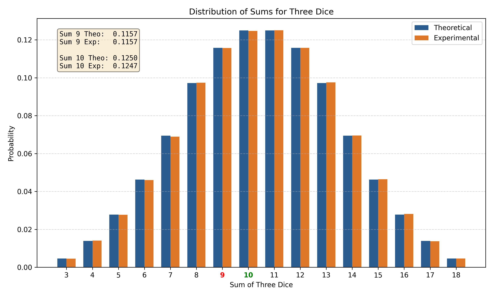

# PSA Laboratory Assignments

## Overview

This repository contains five laboratory assignments for the Probability and Statistics (PSA) course. Each problem uses Python to combine analytical computation with Monte Carlo simulation, allowing theoretical probability results to be verified empirically.

---

## Problem 1 – Galileo's Dice Paradox

### Problem Statement

When rolling three fair six-sided dice, both a sum of 9 and a sum of 10 can be formed from exactly six unordered combinations (partitions). Despite this symmetry, empirical observation shows that a sum of 10 occurs more frequently than a sum of 9. The goal of this problem is to explain and verify this result mathematically and through simulation.

### Mathematical Background

The paradox is resolved by counting ordered outcomes (permutations) rather than unordered partitions. Since the three dice are distinguishable and independent, combinations with repeated values produce fewer arrangements than those with all distinct values.

The total number of possible outcomes when rolling three dice is 6³ = 216.

**Sum of 9 – ordered outcomes:**

| Partition | Permutations |
|-----------|-------------|
| (1, 2, 6) | 6 |
| (1, 3, 5) | 6 |
| (1, 4, 4) | 3 |
| (2, 2, 5) | 3 |
| (2, 3, 4) | 6 |
| (3, 3, 3) | 1 |
| **Total** | **25** |

P(sum = 9) = 25 / 216 ≈ 0.1157

**Sum of 10 – ordered outcomes:**

| Partition | Permutations |
|-----------|-------------|
| (1, 3, 6) | 6 |
| (1, 4, 5) | 6 |
| (2, 2, 6) | 3 |
| (2, 3, 5) | 6 |
| (2, 4, 4) | 3 |
| (3, 3, 4) | 3 |
| **Total** | **27** |

P(sum = 10) = 27 / 216 ≈ 0.1250

Sum 10 has two more ordered outcomes than sum 9, making it strictly more probable despite both having the same number of partitions.

### Methodology

1. **Exhaustive enumeration** – All 216 ordered outcomes are counted by iterating over every possible combination of three dice values. Exact probabilities are computed directly from the counts.
2. **Monte Carlo simulation** – Three dice are rolled 1,000,000 times using NumPy's random number generator. The empirical frequency of each sum is recorded.
3. **Probability comparison** – Theoretical and experimental probabilities are compared side by side for all sums from 3 to 18.
4. **Graph generation** – Results are displayed as a grouped bar chart and saved to `dice_paradox_results.png`.

### Output

Running `problem1.py` prints the following to the console:

```
Combinations resulting in 9:  25  (P = 0.1157)
Combinations resulting in 10: 27  (P = 0.1250)
Graph saved to dice_paradox_results.png
```

A bar chart comparing theoretical and experimental probabilities for all possible sums is generated and saved as `dice_paradox_results.png`. Sums 9 and 10 are highlighted on the x-axis for clarity.



---

## Problem 2 – National Election Simulation

### Problem Statement

A pollster conducts a random sample of voters prior to an election between two candidates (Democrat and Republican) to predict the winner. The simulation models how often the pollster's prediction is correct across 100 repeated trials, under varying sample sizes and vote distributions.

### Simulation Method

Each trial proceeds as follows:

1. A random sample of `n` voters is drawn from the population.
2. Each voter independently votes Democrat with probability `p` and Republican with probability `1 − p`.
3. The pollster predicts a Democrat win if more than half of the sampled votes are Democrat.
4. The prediction is compared against the known true majority.

This process is repeated 100 times per scenario. The output reports how many of the 100 trials resulted in a correct prediction.

### Scenarios Tested

| Sample Size | Democrat | Republican |
| ----------- | -------- | ---------- |
| 1000        | 52%      | 48%        |
| 1000        | 51%      | 49%        |
| 3000        | 52%      | 48%        |
| 3000        | 51%      | 49%        |

### Interpretation

- **Sample size effect** – Larger samples reduce sampling variability. With 3000 voters, the poll results are more consistent and the correct winner is identified more reliably than with 1000 voters.
- **Margin effect** – A 51/49 split is harder to predict correctly than a 52/48 split. The smaller the true margin, the greater the chance that random sampling fluctuations lead the poll to favour the wrong candidate.
- **Combined effect** – Increasing the sample size partially compensates for a narrow margin. The 3000-voter / 51% Democrat scenario performs noticeably better than the 1000-voter equivalent.

Since both programs use random sampling, results will vary slightly between executions. This variability is itself a demonstration of sampling uncertainty.

---

## Problem 3 – Stick Breaking and Triangle Formation

### Problem Statement

A stick of unit length is broken at a uniformly random point. The longer of the two resulting pieces is then broken again at a uniformly random point. The question is: what is the probability that the three resulting pieces can form a triangle?

### Mathematical Background

The triangle inequality requires that no single side exceeds the sum of the other two. Since the three pieces always sum to 1 (the original stick length), this simplifies to a single condition: the longest piece must be strictly less than 0.5.

Let X ~ U(0, 1) be the first breakpoint. The shorter piece has length s = min(X, 1−X) and the longer piece has length L = 1−s. By symmetry we can take X ~ U(0, 1/2), so s = X and L = 1−X.

The longer piece is broken at Y ~ U(0, L), producing sub-pieces Y and L−Y. The triangle condition requires:

* s < 0.5 (always true since s < 1/2)
* Y < 0.5
* L − Y < 0.5, i.e., Y > 1/2 − s

Given X = x, the favorable interval for Y is (1/2 − x, 1/2), which has length x. The conditional probability is x / (1−x).

Integrating over x ∈ (0, 1/2):

P = 2 · ∫₀^{1/2} x/(1−x) dx = 2 · [ln(2) − 1/2] = **2·ln(2) − 1 ≈ 0.3863**

### Methodology

1. **Monte Carlo simulation** – The experiment is repeated 1,000,000 times using NumPy vectorised operations. For each trial, a random first breakpoint generates two pieces, and the longer piece is broken again at a random point.
2. **Triangle validation** – For each set of three pieces, the maximum piece length is compared against 0.5.
3. **Comparison** – The simulated probability is compared with the theoretical value 2·ln(2) − 1.

### Output

Running `problem3.py` prints:

```
Simulated probability:   0.3863
Theoretical probability: 0.3863
```

### Interpretation

As the number of simulation trials increases, the experimental probability converges toward the theoretical value by the law of large numbers. With 1,000,000 trials, the simulated result typically agrees with the theoretical value to three or four decimal places.

---

## Problem 4 – Random Quadrilateral on a Circle

### Problem Statement

Four points are chosen independently and uniformly at random on a circle of unit circumference. The question is: what is the probability that all four interior angles of the resulting quadrilateral are strictly less than 120 degrees?

### Mathematical Background

Since four distinct points on a circle are always in convex position, the quadrilateral is convex with probability 1. The problem therefore reduces to the angle constraint.

Label the sorted points P₁, P₂, P₃, P₄ and let a, b, c, d denote the four arc lengths between consecutive points, so that a + b + c + d = 1.

By the inscribed angle theorem, the interior angle at each vertex equals π times the sum of the two opposite arcs:

| Vertex | Interior Angle |
|--------|----------------|
| P₁     | π(b + c)       |
| P₂     | π(c + d)       |
| P₃     | π(d + a)       |
| P₄     | π(a + b)       |

Requiring all four angles to be strictly less than 120° = 2π/3 yields four inequalities. Since a + b + c + d = 1, these reduce to exactly two independent constraints:

* 1/3 < a + b < 2/3
* 1/3 < b + c < 2/3

The four arc lengths follow a Dirichlet(1,1,1,1) distribution (uniform on the 3-simplex). Integrating over the feasible region analytically gives:

P = 7 / 27 ≈ 0.2593

### Methodology

1. **Random point generation** – Four independent uniform random variables on [0, 1) represent positions on a unit-circumference circle.
2. **Sorting** – The points are sorted to define four consecutive arcs.
3. **Arc computation** – Arc lengths a, b, c are computed from consecutive differences.
4. **Angle constraint check** – The two independent conditions 1/3 < a+b < 2/3 and 1/3 < b+c < 2/3 are evaluated for each trial.
5. **Monte Carlo estimation** – The fraction of 1,000,000 trials satisfying both constraints estimates the probability.

### Output

Running `problem4.py` prints:

```
Simulated probability:   0.2590
Theoretical probability: 0.2593
```

### Interpretation

The simulated probability converges toward the theoretical value 7/27 as the number of trials increases, consistent with the law of large numbers.

---

## Problem 5 – Family Cases

### Problem Statement

Two family planning strategies are compared through simulation:

* **Scenario A** – Each family continues having children until they have a boy.
* **Scenario B** – Each family continues having children until they have at least one boy and at least one girl.

For each scenario, the average number of children per family is estimated, and the total difference across 100,000 families is computed.

Assumptions: each birth is independent, and the probability of a boy equals 0.5.

### Mathematical Background

#### Scenario A

The number of children follows a Geometric(p = 0.5) distribution, where each birth is an independent Bernoulli trial with success (boy) probability 0.5. The expected number of trials until the first success is:

E[children] = 1 / p = 1 / 0.5 = **2**

#### Scenario B

The first child is equally likely to be a boy or a girl. After the first child, the family needs a child of the opposite sex. The waiting time for the opposite sex again follows Geometric(0.5), so:

E[children] = 1 + 1 / 0.5 = 1 + 2 = **3**

#### Comparison

For 100,000 families:

| Scenario | Expected Average | Expected Total |
|----------|-----------------|----------------|
| A        | 2               | 200,000        |
| B        | 3               | 300,000        |

Scenario B produces approximately **100,000 more children** than Scenario A.

### Methodology

1. **Scenario A simulation** – For each family, the number of children is sampled from a Geometric(0.5) distribution using NumPy.
2. **Scenario B simulation** – Each family has one child plus a Geometric(0.5) wait for the opposite sex.
3. **Averaging** – The mean number of children per family is computed for each scenario.
4. **Comparison** – The total children under each scenario are summed and the difference is reported.

### Output

Running `problem5.py` prints:

```
Scenario A (stop after first boy):
  Simulated average:   2.0046
  Theoretical average: 2.0000

Scenario B (stop after both sexes):
  Simulated average:   3.0033
  Theoretical average: 3.0000

Additional children under B for 100,000 families: 99,868
```

### Interpretation

Scenario B requires more children on average because the stopping condition is stricter: the family must obtain both sexes rather than just one specific sex. The additional expected child per family arises from the Geometric waiting time for the second sex after the first child is born. With 100,000 families, this translates to approximately 100,000 additional children in total.

---

## Installation

Requires Python 3. Install dependencies with:

```bash
pip install numpy matplotlib
```

---

## Usage

Run each script independently from the project directory:

```bash
python problem1.py
python problem2.py
python problem3.py
python problem4.py
python problem5.py
```

---

## Repository Structure

```
.
├── problem1.py                # Galileo's Dice Paradox – enumeration, simulation, and plot
├── problem2.py                # Election polling simulation
├── problem3.py                # Stick breaking and triangle formation
├── problem4.py                # Random quadrilateral on a circle
├── problem5.py                # Family planning simulation
├── dice_paradox_results.png   # Bar chart generated by problem1.py
└── README.md
```

---

## Technologies Used

* Python 3
* NumPy
* Matplotlib